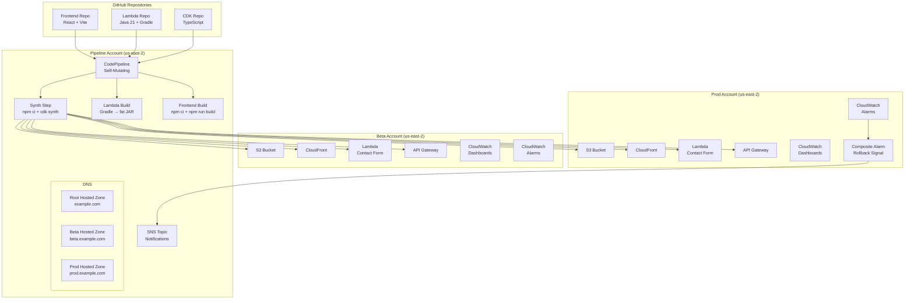
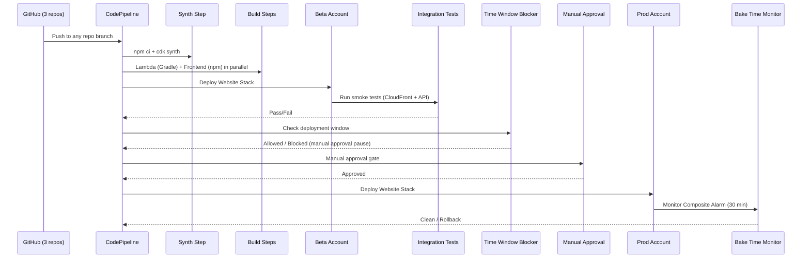
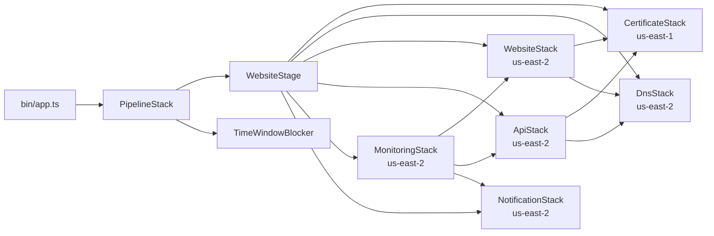

# Design Document: Open-Source Multi-Region Pipeline

## Overview

This design describes an open-source, multi-account AWS CDK pipeline that deploys a static website (S3 + CloudFront) with a serverless contact form backend (Lambda + API Gateway + SES). The pipeline uses only public AWS CDK constructs and standard open-source tooling — no Amazon-internal libraries.

The architecture is modeled after the existing TVCP CDK patterns but translated entirely to public `aws-cdk-lib` constructs. It sources code from three separate GitHub repositories (CDK TypeScript, Lambda Java 21, React frontend), builds all artifacts in CodeBuild, and deploys through Beta → Prod stages in `us-east-2` with cross-account isolation.

### Key Design Decisions

1. **Single region (us-east-2)** for cost optimization, with ACM certs in `us-east-1` for CloudFront (CloudFront requirement). The Configuration Registry supports future multi-region expansion.
2. **Three GitHub repos** connected via CodeStar Connections, unified into a single CodePipeline.
3. **No VPC/NAT** — all services are serverless/edge (S3, CloudFront, Lambda, API Gateway, SES).
4. **DNS flexibility** — a `dnsProvider` flag per stage supports both Route 53 and external providers (Squarespace, Cloudflare).
5. **Public constructs only** — replaces `@amzn/pipelines`, `@amzn/music-cloudwatch`, `@amzn/motecdk` with `aws-cdk-lib/pipelines`, `aws-cdk-lib/aws-cloudwatch`, and standard IAM constructs.

### Design Rationale (TVCP → Open-Source Translation)

| TVCP Pattern | Open-Source Equivalent |
|---|---|
| `@amzn/pipelines.DeploymentPipeline` | `aws-cdk-lib/pipelines.CodePipeline` |
| `@amzn/pipelines.BrazilPackage` sources | `pipelines.CodePipelineSource.connection()` (GitHub) |
| `@amzn/music-cloudwatch.CoralServiceOperationsMonitor` | Manual `aws-cdk-lib/aws-cloudwatch.Alarm` + `CompositeAlarm` |
| `@amzn/motecdk/mote-iam.SecureRole` | `aws-cdk-lib/aws-iam.Role` |
| `SIMTicketAlarmAction` | `aws-cdk-lib/aws-cloudwatch-actions.SnsAction` |
| `@amzn/pipelines` bake time / approval workflows | `pipelines.ManualApprovalStep` + custom Lambda time-window blocker |
| Brazil version sets | GitHub branches + CodeStar Connections |
| `@amzn/hydra` integration tests | CodeBuild shell step with `curl`-based smoke tests |

---

## Architecture

### High-Level Architecture Diagram



### Deployment Flow



### Account Structure

```
AWS Organizations Root
├── Pipeline OU
│   └── Pipeline Account (hosts CodePipeline, Route 53 root zone, SNS)
├── Beta OU
│   └── Beta Account (us-east-2: S3, CloudFront, Lambda, API GW, SES)
└── Prod OU
    └── Prod Account (us-east-2: S3, CloudFront, Lambda, API GW, SES)
```

The root hosted zone lives in the Pipeline account. Stage-level hosted zones (e.g., `beta.example.com`) are also created in the Pipeline account with NS delegation from the root zone (or manual NS records for external DNS providers).

---

## Components and Interfaces

### Project Structure

```
personalWebsiteCDK/
├── bin/
│   └── app.ts                          # CDK app entry point
├── lib/
│   ├── config/
│   │   ├── configuration.ts            # Configuration Registry values
│   │   └── configuration.types.ts      # TypeScript type definitions
│   ├── pipeline/
│   │   └── pipeline-stack.ts           # CodePipeline + stages
│   ├── stacks/
│   │   ├── website-stack.ts            # S3, CloudFront, BucketDeployment
│   │   ├── certificate-stack.ts        # ACM certs (us-east-1 + us-east-2)
│   │   ├── dns-stack.ts               # Route 53 hosted zones + records
│   │   ├── api-stack.ts               # API Gateway + Lambda + SES
│   │   ├── monitoring-stack.ts         # CloudWatch dashboards + alarms
│   │   └── notification-stack.ts       # SNS topic for notifications
│   ├── constructs/
│   │   ├── time-window-blocker.ts      # Lambda-based deployment blocker
│   │   └── bake-time-monitor.ts        # Post-deploy alarm monitoring
│   └── stages/
│       └── website-stage.ts            # CDK Stage grouping all stacks
├── lambda/
│   └── time-window-blocker/
│       └── index.ts                    # Time window evaluation Lambda
├── test/
│   ├── config/
│   │   └── configuration.test.ts       # Configuration validation tests
│   ├── constructs/
│   │   └── time-window-blocker.test.ts # Time window logic tests
│   └── stacks/
│       └── snapshot.test.ts            # CDK snapshot tests
├── scripts/
│   ├── bootstrap.sh                    # CDK bootstrap automation
│   └── integration-test.sh             # Beta smoke test script
├── cdk.json
├── package.json
├── tsconfig.json
└── README.md
```

### Component Dependency Graph



### Key Components

#### 1. PipelineStack (`lib/pipeline/pipeline-stack.ts`)

The top-level stack deployed in the Pipeline account. Creates the self-mutating CodePipeline with three GitHub sources, parallel build steps, and two deployment stages.

```typescript
// Pseudocode interface
class PipelineStack extends cdk.Stack {
  constructor(scope: Construct, id: string, props: PipelineStackProps) {
    // 1. Create three CodePipelineSource.connection() sources
    // 2. Create synth step (npm ci + cdk synth) with CDK source as primary
    // 3. Create CodePipeline with selfMutation: true
    // 4. Add Beta stage with post-deployment integration tests
    // 5. Add Time Window Blocker pre-Prod
    // 6. Add Manual Approval pre-Prod
    // 7. Add Prod stage
    // 8. Add pipeline notification rule → SNS
  }
}
```

#### 2. WebsiteStage (`lib/stages/website-stage.ts`)

A CDK `Stage` that groups all stacks for a single deployment target (Beta or Prod).

```typescript
class WebsiteStage extends cdk.Stage {
  constructor(scope: Construct, id: string, props: WebsiteStageProps) {
    // Instantiates: CertificateStack, DnsStack, WebsiteStack,
    //               ApiStack, MonitoringStack, NotificationStack
  }
}
```

#### 3. WebsiteStack (`lib/stacks/website-stack.ts`)

S3 bucket with OAC, CloudFront distribution, and BucketDeployment.

#### 4. ApiStack (`lib/stacks/api-stack.ts`)

API Gateway HTTP API, Lambda function (Java 21, ARM64), SES identity.

#### 5. CertificateStack (`lib/stacks/certificate-stack.ts`)

Cross-region ACM certificates: one in `us-east-1` for CloudFront, one in `us-east-2` for API Gateway. Both use DNS validation against the stage hosted zone.

#### 6. DnsStack (`lib/stacks/dns-stack.ts`)

Route 53 hosted zone for the stage subdomain. Creates A records for CloudFront and API Gateway. Handles NS delegation to root zone (Route 53) or outputs NS records (external DNS).

#### 7. MonitoringStack (`lib/stacks/monitoring-stack.ts`)

CloudWatch dashboards (CloudFront, Lambda, API Gateway), individual alarms, composite alarm, and SNS alarm actions.

#### 8. TimeWindowBlocker (`lib/constructs/time-window-blocker.ts`)

A construct that adds a pre-Prod Lambda-backed step. The Lambda evaluates the current Pacific Time against allowed windows and holiday lists. If blocked, the pipeline pauses at a manual approval step.

---

## Data Models

### Configuration Registry Types

Modeled after the existing TVCP `configuration.types.ts` but simplified for the open-source use case:

```typescript
// ---- configuration.types.ts ----

/** DNS provider for the root domain */
export type DnsProvider = 'route53' | 'external';

/** Per-repository GitHub source configuration */
export interface RepositoryConfig {
  /** GitHub owner (user or org) */
  owner: string;
  /** Repository name */
  name: string;
  /** Branch to track (default: 'main') */
  branch: string;
  /** CodeStar Connection ARN for GitHub authentication */
  connectionArn: string;
}

/** Website configuration per stage */
export interface WebsiteConfig {
  /** Primary domain (e.g., 'beta.example.com') */
  domainName: string;
  /** www subdomain (e.g., 'www.beta.example.com') */
  wwwSubdomain: string;
  /** API subdomain (e.g., 'api.beta.example.com') */
  apiSubdomain: string;
  /** Route 53 hosted zone ID for the stage subdomain (populated after first deploy) */
  hostedZoneId?: string;
  /** Recipient email for contact form */
  recipientEmail: string;
}

/** Alarm threshold configuration */
export interface AlarmThresholds {
  /** CloudFront 5xx error rate threshold (percentage) */
  cloudFront5xxRate: number;
  /** CloudFront 4xx error rate threshold (percentage) */
  cloudFront4xxRate: number;
  /** Lambda error rate threshold (percentage) */
  lambdaErrorRate: number;
  /** Lambda duration p90 threshold (milliseconds) */
  lambdaDurationP90: number;
  /** API Gateway 5xx error rate threshold (percentage) */
  apiGateway5xxRate: number;
  /** API Gateway latency p90 threshold (milliseconds) */
  apiGatewayLatencyP90: number;
  /** Evaluation periods for the alarm */
  evaluationPeriods: number;
  /** Datapoints to alarm */
  datapointsToAlarm: number;
}

/** Per-stage configuration */
export interface StageConfig {
  /** AWS account ID for this stage */
  accountId: string;
  /** Deployment region (default: 'us-east-2') */
  region: string;
  /** DNS provider for root domain delegation */
  dnsProvider: DnsProvider;
  /** Website configuration */
  website: WebsiteConfig;
  /** CloudFront price class (e.g., 'PriceClass_100') */
  cloudFrontPriceClass: string;
  /** High-severity alarm thresholds */
  highSeverityAlarms: AlarmThresholds;
  /** Low-severity alarm thresholds */
  lowSeverityAlarms: AlarmThresholds;
  /** Bake time in minutes (Prod only, default: 30) */
  bakeTimeMinutes?: number;
  /** Feature flags for regional service availability */
  featureFlags?: Record<string, boolean>;
}

/** Lambda configuration */
export interface LambdaConfig {
  /** Memory size in MB (default: 512) */
  memorySize: number;
  /** Timeout in seconds (default: 30) */
  timeout: number;
  /** Architecture: 'arm64' or 'x86_64' (default: 'arm64') */
  architecture: 'arm64' | 'x86_64';
}

/** Pipeline-level configuration */
export interface PipelineConfig {
  /** Pipeline account ID */
  pipelineAccountId: string;
  /** Pipeline region */
  pipelineRegion: string;
  /** Root domain name (e.g., 'example.com') */
  rootDomainName: string;
  /** Root hosted zone ID in the pipeline account */
  rootHostedZoneId: string;
  /** DNS provider for the root domain */
  rootDnsProvider: DnsProvider;
}

/** Build configuration */
export interface BuildConfig {
  /** Node.js version for frontend build (default: '20') */
  nodeVersion: string;
  /** CodeBuild compute type (default: 'BUILD_GENERAL1_SMALL') */
  computeType: string;
}

/** Time window blocker configuration */
export interface TimeWindowConfig {
  /** Timezone for evaluating windows (default: 'America/Los_Angeles') */
  timezone: string;
  /** Blocked hour start (24h, default: 18 = 6 PM) */
  blockedHourStart: number;
  /** Blocked hour end (24h, default: 6 = 6 AM) */
  blockedHourEnd: number;
  /** Holiday dates in ISO format (YYYY-MM-DD) */
  holidays: string[];
}

/** Top-level application configuration */
export interface ApplicationConfig {
  pipeline: PipelineConfig;
  repositories: {
    cdk: RepositoryConfig;
    lambda: RepositoryConfig;
    frontend: RepositoryConfig;
  };
  build: BuildConfig;
  lambda: LambdaConfig;
  timeWindow: TimeWindowConfig;
  stages: {
    beta: StageConfig;
    prod: StageConfig;
    [key: string]: StageConfig; // Future stages/regions
  };
}
```

### Configuration Registry Values

```typescript
// ---- configuration.ts ----
import { ApplicationConfig } from './configuration.types';

export const config: ApplicationConfig = {
  pipeline: {
    pipelineAccountId: '111111111111',
    pipelineRegion: 'us-east-2',
    rootDomainName: 'example.com',
    rootHostedZoneId: 'Z0123456789ABCDEFGHIJ',
    rootDnsProvider: 'external', // or 'route53'
  },
  repositories: {
    cdk: {
      owner: 'myuser',
      name: 'personalWebsiteCDK',
      branch: 'main',
      connectionArn: 'arn:aws:codestar-connections:us-east-2:111111111111:connection/xxxxxxxx',
    },
    lambda: {
      owner: 'myuser',
      name: 'personalWebsiteLambda',
      branch: 'main',
      connectionArn: 'arn:aws:codestar-connections:us-east-2:111111111111:connection/xxxxxxxx',
    },
    frontend: {
      owner: 'myuser',
      name: 'personalWebsiteFrontend',
      branch: 'main',
      connectionArn: 'arn:aws:codestar-connections:us-east-2:111111111111:connection/xxxxxxxx',
    },
  },
  build: {
    nodeVersion: '20',
    computeType: 'BUILD_GENERAL1_SMALL',
  },
  lambda: {
    memorySize: 512,
    timeout: 30,
    architecture: 'arm64',
  },
  timeWindow: {
    timezone: 'America/Los_Angeles',
    blockedHourStart: 18,
    blockedHourEnd: 6,
    holidays: ['2025-01-01', '2025-07-04', '2025-12-25'],
  },
  stages: {
    beta: {
      accountId: '222222222222',
      region: 'us-east-2',
      dnsProvider: 'external',
      website: {
        domainName: 'beta.example.com',
        wwwSubdomain: 'www.beta.example.com',
        apiSubdomain: 'api.beta.example.com',
        recipientEmail: 'contact@example.com',
      },
      cloudFrontPriceClass: 'PriceClass_100',
      highSeverityAlarms: {
        cloudFront5xxRate: 5,
        cloudFront4xxRate: 15,
        lambdaErrorRate: 5,
        lambdaDurationP90: 10000,
        apiGateway5xxRate: 5,
        apiGatewayLatencyP90: 10000,
        evaluationPeriods: 3,
        datapointsToAlarm: 2,
      },
      lowSeverityAlarms: {
        cloudFront5xxRate: 1,
        cloudFront4xxRate: 10,
        lambdaErrorRate: 1,
        lambdaDurationP90: 5000,
        apiGateway5xxRate: 1,
        apiGatewayLatencyP90: 5000,
        evaluationPeriods: 5,
        datapointsToAlarm: 3,
      },
    },
    prod: {
      accountId: '333333333333',
      region: 'us-east-2',
      dnsProvider: 'external',
      website: {
        domainName: 'example.com',
        wwwSubdomain: 'www.example.com',
        apiSubdomain: 'api.example.com',
        recipientEmail: 'contact@example.com',
      },
      cloudFrontPriceClass: 'PriceClass_100',
      highSeverityAlarms: {
        cloudFront5xxRate: 3,
        cloudFront4xxRate: 10,
        lambdaErrorRate: 3,
        lambdaDurationP90: 5000,
        apiGateway5xxRate: 3,
        apiGatewayLatencyP90: 5000,
        evaluationPeriods: 3,
        datapointsToAlarm: 2,
      },
      lowSeverityAlarms: {
        cloudFront5xxRate: 0.5,
        cloudFront4xxRate: 5,
        lambdaErrorRate: 0.5,
        lambdaDurationP90: 3000,
        apiGateway5xxRate: 0.5,
        apiGatewayLatencyP90: 3000,
        evaluationPeriods: 5,
        datapointsToAlarm: 3,
      },
      bakeTimeMinutes: 30,
    },
  },
};
```

### Stack Props Interfaces

```typescript
interface WebsiteStageProps extends cdk.StageProps {
  stageConfig: StageConfig;
  pipelineConfig: PipelineConfig;
  lambdaConfig: LambdaConfig;
  /** Path to built frontend assets (from Frontend_Build_Step) */
  frontendBuildOutput: string;
  /** Path to Lambda fat JAR (from Lambda_Build_Step) */
  lambdaJarPath: string;
  stageName: 'beta' | 'prod';
}

interface WebsiteStackProps extends cdk.StackProps {
  websiteConfig: WebsiteConfig;
  cloudFrontPriceClass: string;
  certificateArn: string;        // From CertificateStack (us-east-1)
  hostedZoneId: string;           // From DnsStack
  frontendBuildOutput: string;
}

interface ApiStackProps extends cdk.StackProps {
  websiteConfig: WebsiteConfig;
  lambdaConfig: LambdaConfig;
  certificateArn: string;        // From CertificateStack (us-east-2)
  hostedZoneId: string;           // From DnsStack
  lambdaJarPath: string;
  allowedOrigin: string;          // CloudFront domain for CORS
}

interface MonitoringStackProps extends cdk.StackProps {
  stageName: string;
  distribution: cloudfront.Distribution;
  lambdaFunction: lambda.Function;
  httpApi: apigatewayv2.HttpApi;
  highSeverityAlarms: AlarmThresholds;
  lowSeverityAlarms: AlarmThresholds;
  notificationTopic: sns.Topic;
}
```

---

## Correctness Properties

*A property is a characteristic or behavior that should hold true across all valid executions of a system — essentially, a formal statement about what the system should do. Properties serve as the bridge between human-readable specifications and machine-verifiable correctness guarantees.*

This feature is primarily Infrastructure as Code (CDK/CloudFormation), which is declarative configuration rather than algorithmic logic. Most acceptance criteria are best validated with CDK assertion tests (snapshot tests, `Template.hasResourceProperties()`) and integration tests rather than property-based testing.

However, the **Time Window Blocker** contains pure function logic that is an excellent candidate for property-based testing. The function `isDeploymentAllowed(timestamp, config)` takes a timestamp and configuration (blocked hours, weekend rules, holiday list) and returns a boolean. This logic varies meaningfully with input, and 100+ random timestamps will exercise edge cases around midnight boundaries, DST transitions, month boundaries, and holiday matching that example-based tests would miss.

### Property 1: Time window blocker correctly classifies all timestamps

*For any* timestamp and any valid time window configuration (blocked hour start/end, timezone, holiday list), the `isDeploymentAllowed` function SHALL return `false` if and only if the timestamp falls within blocked weekday hours (between `blockedHourStart` and `blockedHourEnd` in the configured timezone), OR the timestamp falls on a weekend (Saturday or Sunday in the configured timezone), OR the timestamp's date matches any date in the holiday list.

**Validates: Requirements 19.2, 19.3, 19.4**

---

## Error Handling

### Pipeline Failures

| Failure Scenario | Handling Strategy |
|---|---|
| **Synth step fails** (TypeScript compilation, CDK synth error) | Pipeline halts. CodePipeline notification rule sends failure details to SNS topic. Developer investigates via CodeBuild logs. |
| **Frontend build fails** (npm ci or npm run build error) | Pipeline halts at build step. Notification sent. No deployment occurs. |
| **Lambda build fails** (Gradle compilation or test failure) | Pipeline halts at build step. Notification sent. No deployment occurs. |
| **Beta deployment fails** (CloudFormation stack error) | CloudFormation automatically rolls back the failed stack. Pipeline halts. Notification sent. |
| **Integration test fails** (HTTP smoke test returns non-200) | Pipeline halts before Prod promotion. Notification sent. Beta deployment remains (may be rolled back manually). |
| **Time window blocks deployment** | Pipeline pauses at manual approval step. Operator can override or wait for the next allowed window. |
| **Prod deployment fails** | CloudFormation rolls back. Composite alarm may also trigger. Notification sent. |
| **Bake time alarm fires** | CloudFormation rollback triggered automatically via CDK Pipelines alarm-based rollback. SNS notification sent. |
| **Manual approval timeout** | Pipeline execution fails after the configured timeout. Notification sent. |

### Stack-Level Error Handling

| Component | Error Scenario | Handling |
|---|---|---|
| **ACM Certificate** | DNS validation timeout (72 hours) | CloudFormation stack creation fails and rolls back. CfnOutput provides NS records for external DNS users to add manually. |
| **S3 BucketDeployment** | Asset upload failure | CloudFormation rolls back. S3 versioning allows recovery of previous assets. |
| **CloudFront Invalidation** | Invalidation failure | BucketDeployment surfaces error in CloudFormation events. Distribution continues serving cached content. |
| **Lambda (Contact Form)** | SES send failure | Lambda returns 500 with error message. CloudWatch alarm triggers if error rate exceeds threshold. |
| **Lambda (Contact Form)** | Invalid input | Lambda returns 400 with validation error details. No alarm triggered (client error). |
| **API Gateway** | Lambda timeout | API Gateway returns 504. CloudWatch latency alarm triggers if sustained. |
| **SES Identity** | Email not verified | SES rejects sends. Lambda returns 500. Alarm triggers on error rate. |
| **Route 53** | Hosted zone creation in wrong account | Stack fails. Cross-account role trust policy prevents unauthorized access. |

### Cross-Account Error Handling

- **CDK bootstrap missing**: `cdk deploy` fails with "need to bootstrap" error. The `bootstrap.sh` script automates this for all accounts.
- **Trust policy misconfigured**: Cross-account assume-role fails. Pipeline stack deployment fails with clear IAM error.
- **Account not in Organizations**: SCP prevents resource creation outside allowed regions. Stack fails with explicit deny error.

---

## Testing Strategy

### Testing Approach

This feature uses a **three-tier testing strategy**:

1. **CDK Assertion Tests** (unit-level) — Verify synthesized CloudFormation templates contain expected resources, properties, and configurations
2. **Property-Based Tests** — Verify the time window blocker logic across many random inputs
3. **Integration Tests** — Verify deployed resources work end-to-end in the Beta stage

Property-based testing is limited to the Time Window Blocker because the rest of the feature is declarative IaC. CDK assertion tests and snapshot tests are the appropriate validation approach for CloudFormation resource configuration.

### CDK Assertion Tests

CDK assertion tests use `aws-cdk-lib/assertions.Template` to verify synthesized templates. These cover the vast majority of acceptance criteria.

**Test categories:**

| Category | What's Tested | Example Assertions |
|---|---|---|
| **Pipeline structure** | Sources, stages, steps, approvals | 3 source actions exist; Beta and Prod stages present; manual approval before Prod |
| **Website stack** | S3, CloudFront, BucketDeployment | S3 blockPublicAccess all; OAC configured; CloudFront redirects HTTP→HTTPS; error pages route to /index.html |
| **API stack** | API Gateway, Lambda, SES | POST /contact route; CORS config; Lambda ARM64 + 512MB; SES identity |
| **Certificate stack** | ACM certificates | us-east-1 cert for CloudFront domain; us-east-2 cert for API domain; DNS validation |
| **DNS stack** | Route 53 zones and records | Stage hosted zone created; A records for CloudFront and API Gateway; NS delegation (route53 mode) or CfnOutput (external mode) |
| **Monitoring stack** | Dashboards, alarms, composite alarm | 3 dashboards; alarms with correct thresholds from config; composite alarm aggregates children; SNS alarm actions on Prod |
| **Security** | IAM roles, bucket policies | Lambda role has only ses:SendEmail + logs; S3 policy allows only CloudFront OAC; no VPC/NAT/EIP resources |
| **Cost optimization** | PriceClass, compute types, lifecycle | PriceClass_100; BUILD_GENERAL1_SMALL; S3 lifecycle rules; no VPC resources |
| **DNS provider branching** | route53 vs external behavior | With route53: NS records in root zone. With external: CfnOutput with NS records. |

**Snapshot tests:** A full `cdk synth` snapshot test captures the complete synthesized template for regression detection.

### Property-Based Tests

**Library:** [fast-check](https://github.com/dubzzz/fast-check) (TypeScript PBT library)

**Configuration:** Minimum 100 iterations per property test.

| Property | Test Description | Tag |
|---|---|---|
| Property 1: Time window blocker correctness | Generate random timestamps (across years, months, days, hours, minutes, timezones) and random time window configs (blocked hours, holiday lists). Verify `isDeploymentAllowed()` returns the correct boolean. | `Feature: open-source-multi-region-pipeline, Property 1: Time window blocker correctly classifies all timestamps` |

**Generator strategy for Property 1:**
- Generate random `Date` objects spanning multiple years (2024–2030)
- Generate random `blockedHourStart` (0–23) and `blockedHourEnd` (0–23)
- Generate random holiday lists (0–20 dates)
- Generate random timezone strings from a fixed set (America/Los_Angeles, America/New_York, UTC, Europe/London)
- Oracle: independently compute expected result using the same rules (check day-of-week, hour-of-day in timezone, date match against holidays)

### Integration Tests (Beta Stage)

The `integration-test.sh` script runs as a post-deployment CodeBuild step in Beta:

1. **CloudFront health check**: `curl -s -o /dev/null -w "%{http_code}" https://beta.example.com` → expect 200
2. **CloudFront content check**: `curl -s https://beta.example.com` → expect HTML containing `<div id="root">`
3. **API Gateway health check**: `curl -s -X POST https://api.beta.example.com/contact -H "Content-Type: application/json" -d '{"name":"Test","email":"test@test.com","subject":"Test","message":"Test"}' -w "%{http_code}"` → expect 200
4. **API Gateway error handling**: `curl -s -X POST https://api.beta.example.com/contact -H "Content-Type: application/json" -d '{}' -w "%{http_code}"` → expect 400

Environment variables provided: `CLOUDFRONT_URL`, `API_GATEWAY_URL`, `REGION`, `STAGE`.

### Test Execution

```bash
# Run all tests (CDK assertions + property tests)
npx jest --run

# Run only property tests
npx jest --run --testPathPattern="time-window-blocker"

# Run only CDK assertion tests
npx jest --run --testPathPattern="snapshot|stack"
```
